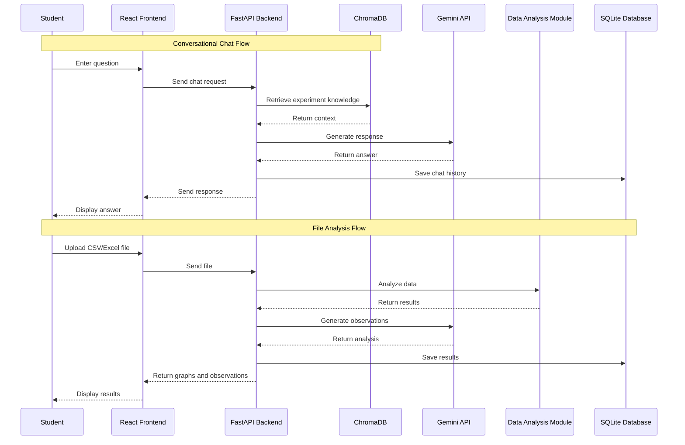

# System Architecture: LabMate AI – AI Engineering Lab Assistant Chatbot

This document describes the architectural design and system components of **LabMate AI**. It explains the major system modules, data flow, APIs, database design, security considerations, and future scalability.

---

# System Overview

LabMate AI is a web-based AI engineering laboratory assistant designed to help students during laboratory experiments. The system provides a chatbot interface for answering experiment-related questions, analyzing experimental data, generating graphs, and producing observations and conclusions.

The application follows a **client-server architecture** where the React frontend communicates with the FastAPI backend. The backend interacts with the Gemini API, ChromaDB, data analysis modules, and the SQLite database.

---

# High-Level Architecture

```text
                +----------------------+
                |       Student        |
                +----------+-----------+
                           |
                           v
                +----------------------+
                |   React Frontend     |
                |   (User Interface)   |
                +----------+-----------+
                           |
                    HTTP Requests
                           |
                           v
                +----------------------+
                |    FastAPI Backend   |
                +----------+-----------+
                           |
        +------------------+------------------+
        |                  |                  |
        v                  v                  v
+---------------+ +---------------+ +---------------+
| Gemini API    | | ChromaDB      | | Pandas/NumPy |
+---------------+ +---------------+ +---------------+
                           |
                           v
                   +---------------+
                   | Matplotlib    |
                   +---------------+
                           |
                           v
                   +---------------+
                   | SQLite        |
                   +---------------+
```

---

# Architecture Components

## 1. Frontend Layer

### Responsibilities

* Provides the chatbot interface.
* Allows file uploads.
* Displays graphs and results.
* Shows AI responses and experiment observations.
* Provides report download options.

### Technologies

* React.js
* Vite
* Axios
* CSS

---

## 2. Backend Layer

### Responsibilities

* Handles API requests.
* Manages chat sessions.
* Processes uploaded files.
* Coordinates AI responses.
* Performs data analysis.
* Stores experiment information.

### Technology

* FastAPI

### APIs

* POST `/chat`
* POST `/upload`
* POST `/analyze`
* POST `/report`

---

## 3. AI Layer

### Gemini API

The AI layer is responsible for:

* Answering student questions.
* Explaining concepts.
* Generating observations.
* Generating conclusions.
* Assisting with experiment understanding.

---

## 4. RAG Layer

### ChromaDB

The RAG layer provides contextual information.

Responsibilities:

* Store laboratory manuals.
* Store experiment documents.
* Retrieve relevant content.
* Improve chatbot accuracy.

---

## 5. Data Processing Layer

### Pandas and NumPy

Responsibilities:

* Read CSV files.
* Read Excel files.
* Clean experimental data.
* Perform calculations.
* Generate numerical results.

---

## 6. Visualization Layer

### Matplotlib

Responsibilities:

* Generate experiment graphs.
* Plot characteristics curves.
* Display analysis results.

Supported graphs:

* Voltage vs Current graph.
* RC charging curve.
* Diode characteristic curve.

---

## 7. Database Layer

### SQLite Database

Stores:

* Chat history.
* Session information.
* Experiment results.
* Generated reports.

Database File:

```text
labmate.db
```

---

# Data Flow

## Conversational Chat Flow

1. Student enters a question.
2. React sends the request to FastAPI.
3. FastAPI searches ChromaDB.
4. Relevant information is retrieved.
5. Gemini generates the response.
6. The response is stored in SQLite.
7. The answer is returned to the frontend.

---

## File Analysis Flow

1. Student uploads CSV or Excel data.
2. FastAPI validates the file.
3. Pandas reads the data.
4. NumPy performs calculations.
5. Matplotlib generates graphs.
6. Gemini generates observations.
7. Results are stored in SQLite.
8. Results are displayed to the user.

---

# Component Interaction Diagram



---

# API Architecture

| Method | Endpoint | Purpose                 |
| ------ | -------- | ----------------------- |
| POST   | /chat    | Send user messages      |
| POST   | /upload  | Upload files            |
| POST   | /analyze | Analyze experiment data |
| POST   | /report  | Generate reports        |

---

# Security Considerations

* Store API keys in environment variables.
* Validate uploaded files.
* Restrict unsupported file types.
* Validate user input.
* Handle application errors safely.

---

# Scalability Considerations

Future improvements may include:

* PostgreSQL database support.
* User authentication.
* Additional experiments.
* PDF report generation.
* Voice interaction.
* Cloud deployment.

---

# Design Principles

* Modular Architecture
* Separation of Concerns
* Reusable Components
* Maintainable Code
* Scalable Design
* Context-Aware AI Responses
* Simple User Experience

---

# Conclusion

LabMate AI follows a modular client-server architecture that combines artificial intelligence, retrieval-augmented generation, data analysis, and visualization techniques to assist engineering students during laboratory experiments. The architecture is designed to be maintainable, scalable, and suitable for future enhancements.


